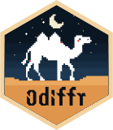
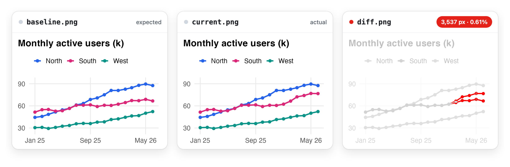

<h1 align="center">
  <br>
  odiffr
</h1>

<p align="center">
  <strong>Fast pixel-by-pixel image comparison for R.</strong><br>
  Catch visual regressions in plots, Shiny apps, screenshots and PDFs,
  powered by <a href="https://github.com/dmtrKovalenko/odiff">odiff</a>.
</p>

<!-- badges: start -->
<p align="center">
  <a href="https://CRAN.R-project.org/package=odiffr"></a>
  <a href="https://github.com/BenWolst/odiffr/actions/workflows/R-CMD-check.yaml"></a>
  <a href="https://app.codecov.io/gh/BenWolst/odiffr"></a>
  <a href="https://github.com/BenWolst/odiffr/blob/main/LICENSE.md"></a>
</p>
<!-- badges: end -->

<p align="center" class="pkgdown-hide">
  <a href="https://benwolst.github.io/odiffr/articles/getting-started.html"></a>
  <a href="https://benwolst.github.io/odiffr/"></a>
  <a href="https://benwolst.github.io/odiffr/reference/"></a>
  <a href="https://benwolst.github.io/odiffr/news/"></a>
</p>

<br>



<p align="center"><sub>Real odiffr output: the diff image comes from the call in step 2 below.</sub></p>

## Why odiffr

<table>
  <tr>
    <td width="33%" valign="top">
      <strong>Fast</strong><br>
      odiff is written in Zig with SIMD, about 6x faster than ImageMagick in
      <a href="https://github.com/dmtrKovalenko/odiff#benchmarks">its benchmarks</a>.
    </td>
    <td width="33%" valign="top">
      <strong>Takes what you have</strong><br>
      PNG, JPEG, WEBP, TIFF and BMP files, magick images, ggplot2, base and
      grid plots, and PDF pages.
    </td>
    <td width="33%" valign="top">
      <strong>Fits testthat</strong><br>
      <code>expect_images_match()</code>, <code>expect_snapshot_image()</code>
      and a comparison function for shinytest2 screenshots.
    </td>
  </tr>
  <tr>
    <td valign="top">
      <strong>Ignores the noise</strong><br>
      Thresholds, antialiasing detection, ignore regions and an overall
      tolerance, with presets for screenshots and cross-platform runs.
    </td>
    <td valign="top">
      <strong>Made for CI</strong><br>
      HTML, Markdown and JUnit reports, a ready-made GitHub Actions workflow,
      and <code>approve_changes()</code> to accept new baselines.
    </td>
    <td valign="top">
      <strong>Auditable</strong><br>
      Pin a validated binary and write JSON or CSV audit records with file
      hashes. Core functions depend only on base R.
    </td>
  </tr>
</table>

## Get started in three steps

1. **Install odiffr and the odiff binary.** `install_odiff()` downloads odiff
   (>= 4.1.1) for your platform, with no Node.js needed.

   ```r
   install.packages("odiffr")
   # or the development version: pak::pak("BenWolst/odiffr")
   odiffr::install_odiff()
   ```

2. **Compare two images.** You get the result as a data frame and the changes
   drawn in red in `diff.png`.

   ```r
   library(odiffr)
   result <- compare_images("baseline.png", "current.png", diff_output = "diff.png",
                            antialiasing = TRUE, diff_overlay = 0.75)
   result$diff_count
   #> [1] 3537
   ```

3. **Make it a test.** testthat stores the first image as the baseline and
   fails when a later run differs.

   ```r
   test_that("the usage chart is unchanged", {
     # usage_chart: a ggplot, a recorded plot or a function that draws one
     expect_snapshot_image(usage_chart)
   })
   ```

## What do you want to do?

| Task | Start with |
| --- | --- |
| Compare two images, plots or magick images | [`compare_images()`](https://benwolst.github.io/odiffr/reference/compare_images.html) |
| Test plots with testthat | [`expect_snapshot_image()`](https://benwolst.github.io/odiffr/reference/expect_snapshot_image.html), [`expect_images_match()`](https://benwolst.github.io/odiffr/reference/expect_images.html) |
| Test a Shiny app | [`compare_file_odiff()`](https://benwolst.github.io/odiffr/reference/compare_file_odiff.html) and the [shinytest2 guide](https://benwolst.github.io/odiffr/articles/shinytest2.html) |
| Test web pages, reports and htmlwidgets | The [web pages guide](https://benwolst.github.io/odiffr/articles/web-pages.html) |
| Compare PDF reports page by page | [`compare_pdfs()`](https://benwolst.github.io/odiffr/reference/compare_pdfs.html) and the [PDF guide](https://benwolst.github.io/odiffr/articles/pdf-outputs.html) |
| Compare folders and accept changes | [`compare_image_dirs()`](https://benwolst.github.io/odiffr/reference/compare_image_dirs.html), [`approve_changes()`](https://benwolst.github.io/odiffr/reference/approve_changes.html) |
| Report results in CI | [`use_odiffr_ci()`](https://benwolst.github.io/odiffr/reference/use_odiffr_ci.html), [`batch_report()`](https://benwolst.github.io/odiffr/reference/batch_report.html) |
| Keep an audit trail | [`audit_record()`](https://benwolst.github.io/odiffr/reference/audit_record.html) |

## Examples

<details>
<summary><b>Comparison options</b>: sensitivity, antialiasing, ignore regions, tolerance</summary>

```r
# Sensitivity (0-1, lower is stricter) and antialiasing detection
compare_images("before.png", "after.png", threshold = 0.05, antialiasing = TRUE)

# Fail straight away when the dimensions differ
compare_images("before.png", "after.png", fail_on_layout = TRUE)

# Skip areas with dynamic content, such as a timestamp
compare_images("before.png", "after.png",
  ignore_regions = list(ignore_region(0, 0, 200, 50))
)

# Pass when up to 1% of pixels differ (development version)
compare_images("before.png", "after.png", max_diff_percent = 1)$reason
#> [1] "within-tolerance"
```

`plot(odiff_run(...))` shows the baseline, current and diff images side by
side, and `diff_image()` returns the diff as a magick image or raster.

</details>

<details>
<summary><b>testthat expectations and snapshots</b></summary>

```r
test_that("the dashboard renders correctly", {
  expect_images_match("screenshots/current.png", "screenshots/baseline.png")
})

test_that("dark mode changes the page", {
  expect_images_differ("screenshots/dark.png", "screenshots/light.png")
})

test_that("plots are stable", {
  p <- ggplot2::ggplot(mtcars, ggplot2::aes(wt, mpg)) + ggplot2::geom_point()
  expect_snapshot_image(p)
  expect_snapshot_image(function() hist(mtcars$mpg), name = "mpg-hist",
                        preset = "screenshot")
})

# After an intended change
testthat::snapshot_review()
testthat::snapshot_accept()
```

Plots are rendered with ragg when it is installed, and a failing
`expect_images_match()` saves a diff image to `tests/testthat/_odiffr/`.
`odiff_preset()` has calibrated settings: `"strict"`, `"default"`,
`"screenshot"` and `"cross_platform"`. Image snapshots are skipped on CRAN, like
other file snapshots. On CI, `snapshot_report()` writes an HTML, Markdown or
JUnit report of the snapshots that changed.

</details>

<details>
<summary><b>Shiny apps with shinytest2</b></summary>

```r
app$expect_screenshot(compare = compare_file_odiff(preset = "screenshot"))
```

odiff tolerates browser antialiasing noise and leaves a diff image when a
screenshot changes.

</details>

<details>
<summary><b>Folders, reports and approving changes</b></summary>

```r
results <- compare_image_dirs("baseline/", "current/", recursive = TRUE,
                              diff_dir = "diffs/")
summary(results)
failed_pairs(results)

batch_report(results, "diffs/report.html", images = "all", embed = TRUE)

approve_changes(results, dry_run = TRUE)
approve_changes(results)

# Or compare and write the report in one call
compare_dirs_report("baseline/", "current/")
```

Files missing from `current/` fail as `"missing"`, and pairs that can't be
compared become `"error"` rows instead of stopping the run.
`compare_images_batch()` compares an explicit list of pairs, optionally in
parallel.

</details>

<details>
<summary><b>PDF reports</b></summary>

```r
res <- compare_pdfs("before/report.pdf", "after/report.pdf", dpi = 150,
                    diff_dir = "pdf-diffs")
failed_pairs(res)[, c("page", "reason", "diff_percentage")]

compare_pdf_dirs("outputs-old/", "outputs-new/", diff_dir = "pdf-diffs")
```

Needs the pdftools package.

</details>

<details>
<summary><b>GitHub Actions and other CI</b></summary>

```r
odiffr::use_odiffr_ci()
```

This adds `.github/workflows/odiffr.yaml`, which installs odiff, runs your
tests, summarises changed snapshots on the job page and uploads diff images
when tests fail. For your own workflows:

```yaml
- name: Compare images
  run: |
    library(odiffr)
    results <- compare_image_dirs("baseline/", "current/", diff_dir = "diffs/")
    batch_markdown(results)                    # GitHub job summary
    batch_junit(results, "odiffr-junit.xml")   # test report
    if (any(!results$match)) stop("Visual regression detected")
  shell: Rscript {0}
```

</details>

<details>
<summary><b>Validated environments</b></summary>

```r
options(odiffr.path = "/validated/bin/odiff-4.5.0")

result <- odiff_run("baseline.png", "current.png", "diff.png", threshold = 0.05)
audit_record(result, file = "audit.json")
```

Audit records hold input and output file hashes, the odiff version and binary
hash, parameters, platform and a UTC timestamp. Core functions depend only on
base R.

</details>

<details>
<summary><b>Managing the odiff binary</b></summary>

```r
odiff_available()   # is odiff installed?
odiff_info()        # path, version and source
install_odiff()     # download odiff to the user cache
```

In interactive sessions odiffr offers to install odiff the first time it is
needed, and never downloads anything without asking. It looks for odiff in
`options(odiffr.path)`, then on the `PATH`, then in the cache that
`install_odiff()` uses. You can also install it with
`npm install -g odiff-bin`. For npm installs of odiff >= 4.4, odiffr calls
the native binary directly rather than the Node.js launcher, which makes each
comparison around 5x faster.

</details>

## Good to know

- **Formats:** PNG, JPEG, WEBP, TIFF (`.tiff`, not `.tif`) and BMP in, PNG
  diffs out. Different formats can be compared with each other.
- **Platforms:** Windows, macOS (Intel and Apple Silicon) and Linux.
- **Speed:** on x86_64 CPUs with AVX-512, `odiff_run(enable_asm = TRUE)` makes
  comparisons about 12% faster.

## Related

- [vdiffr](https://CRAN.R-project.org/package=vdiffr): SVG snapshot testing
  for ggplot2 and grid graphics, a complement to pixel-based tests
- [shinytest2](https://CRAN.R-project.org/package=shinytest2): testing for Shiny apps
- [magick](https://CRAN.R-project.org/package=magick): image processing with ImageMagick

<br>

<p align="center"><sub>MIT licensed · Built on <a href="https://github.com/dmtrKovalenko/odiff">odiff</a> by Dmitriy Kovalenko</sub></p>
